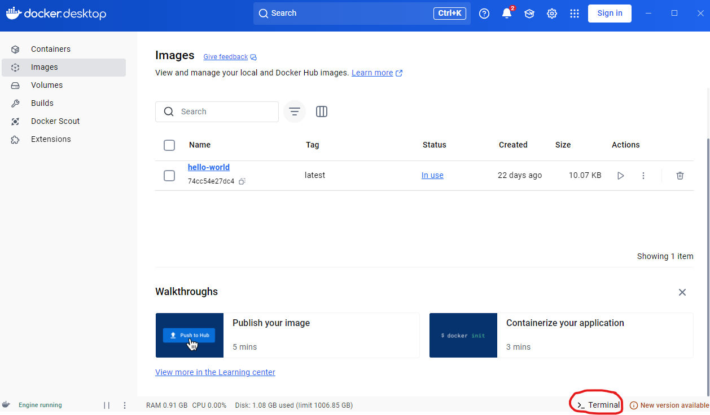

# Manual de Docker Desktop 

> Tarea evaluable Docker - Ejercicio 1  - Samuel Muñiz González , Oscar Mateos Ramos

------

[TOC]

## Introduccion

Docker Desktop es una aplicación que permite construir, ejecutar y administrar contenedores  Docker de manera sencilla en Windows y macOS. Este manual proporciona una guía básica sobre  su instalación y uso

## 1. Instalación de Docker Desktop

### 1.1Requisitos previos

Windows 10/11 (con WSL 2 habilitado) o macOS

 4GB de RAM mínimo 

Virtualización habilitada en la BIOS

### 1.2 Descarga e Instalación

1. Ve al sitio oficial de Docker:  https://www.docker.com/products/docker-desktop

   

2. Descarga la versión correspondiente a tu sistema operativo.
3. Ejecuta el instalador y sigue los pasos.
4. Reinicia tu computadora si es necesario.
5.  Abre Docker Desktop y verifica que esté en funcionamiento.

## 2. Configuración Inicial

1. Inicia Docker Desktop. 
2. Asegúrate de que Docker esté ejecutándose revisando el icono en la barra de tareas. 
3. En Windows, verifica que WSL 2 esté habilitado (Configuración > Recursos > WSL Integration)

## 3. Comandos Básicos de Docker y uso de terminal

Docker Desktop cuenta con una terminal para poder usarla y ejecutar comandos Docker. Estos  son comandos básicos de Docker

| Comando                       | Descripción                                     |
| ----------------------------- | ----------------------------------------------- |
| `docker --version`            | Verifica la versión de Docker instalada         |
| `docker run hello-world`      | Prueba si Docker está funcionando correctamente |
| `docker images`               | Lista las imágenes disponibles en tu equipo     |
| `docker ps`                   | Muestra los contenedores en ejecución           |
| `docker ps -a`                | Lista todos los contenedores creados            |
| `docker stop <ID_CONTENEDOR>` | Detiene un contenedor en ejecución              |
| `docker rm <ID_CONTENEDOR>`   | Elimina un contenedor detenido                  |
| `docker rmi <ID_IMAGEN>`      | Elimina una imagen de Docker                    |

Para poder usar la Terminad de Docker Desktop simplemente hay que hacer un click abajo a la  derecha donde pone Terminal

## 4. Uso de Docker Desktop

### 4.1 Interfaz Principal

Al abrir Docker Desktop, encontrarás varias pestañas clave: 

**Containers**: Muestra los contenedores en ejecución. 

**Images**: Lista las imágenes disponibles en tu sistema. 

**Volumes**: Administra los volúmenes de almacenamiento. 

**Extensions**: Permite agregar funcionalidades adicionales a Docker Desktop.

### 4.2 Creación y Gestión de Contenedores desde Cero

**1. Descargar una Imagen Base**

1. Abre Docker y ve a la pestaña **Images**.

2. Haz clic en **Search image to run**.

   

3. Busca una imagen en Docker Hub (por ejemplo, `nginx` o `ubuntu`).

4. Descárgala haciendo clic en **Pull**.

   

   Luego, en la pestaña de imágenes ya tendríamos una lista con las imagenes que tenemos con las opciones de borrar, arrancar, configurar...

   

**2. Crear un Contenedor**

1. Ve a la pestaña **images** y selecciona la imagen que quieras.

2.  Haz clic en **botón de arrancar**.

   

3. Configura el contenedor:

   - **Asigna un nombre** para identificarlo fácilmente.

   - **Define los puertos** para acceder a los servicios del contenedor.

   - **Configura volúmenes** si necesitas persistencia de datos.

   - **Selecciona redes personalizadas** si el contenedor debe comunicarse con otros servicios.

   - Te deberia salir algo como lo siguiente:

     

4. Haz clic en **Run** para iniciarlo.

**3. Administrar Contenedores**

1. Una vez iniciado, puedes ver su estado en la pestaña **Containers**.

   

2. Usa los botones disponibles para:

   - **Detener** el contenedor.

   - **Eliminar** el contenedor.

   - **Reiniciar** el contenedor.

     

3. Puedes abrir una **terminal dentro del contenedor** para ejecutar comandos directamente.

## 4.3 Gestión de Imágenes

1. Ve a la pestaña Images. 
2. Ahí te saldrá una lista de imágenes que tienes 
3. Puedes eliminar imágenes no utilizadas para liberar espacio.

## 4.4 Uso de Volúmenes

1.**Abrir la pestaña "Volumes"**

- En Docker Desktop, ve a la pestaña **Volumes** en la barra lateral.

2.**Crear un nuevo volumen**

- Haz clic en **Create Volume**.

- Asigna un **nombre** al volumen para identificarlo fácilmente.

- Guarda los cambios.

  

3.**Asignar el volumen a un contenedor**

- Sigue los pasos para crear un contenedor mencionados anteriromente 

- En la configuración, busca la sección **Volumes** y **asigna el volumen creado** a un directorio dentro del contenedor (por ejemplo, `/data`).

  

- Completa la configuración y haz clic en **Run** para iniciar el contenedor.

## 5. Solucion de problemas

**1. Verificar el estado de Docker**

Docker Desktop muestra un **banner de estado** en la parte superior si hay un problema. Si Docker está teniendo dificultades, es posible que veas un enlace para **"diagnosticar"** o **"ver detalles"** sobre el error.

**2. Reiniciar Docker Desktop**

Si Docker está funcionando incorrectamente, muchas veces basta con reiniciarlo. Para hacerlo:

- Si Docker está funcionando incorrectamente, a veces solo es necesario reiniciar Docker.  Puedes hacer esto desde el ícono de Docker en la bandeja del sistema.

  

