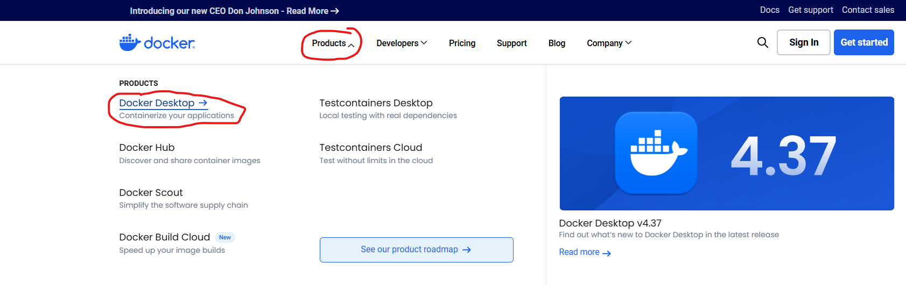
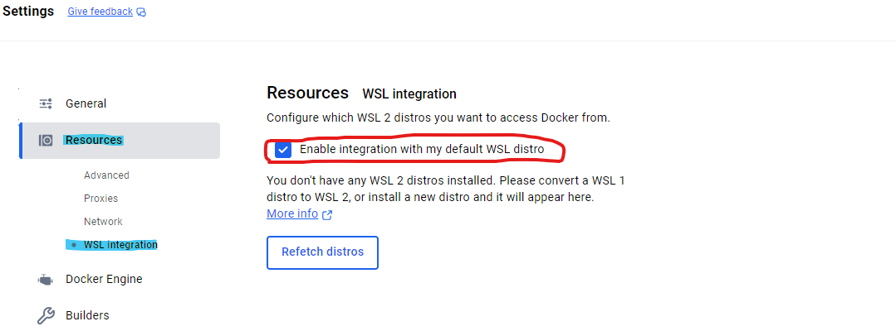
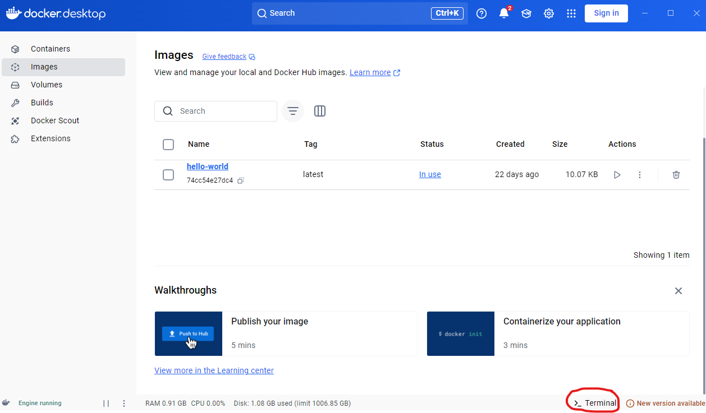
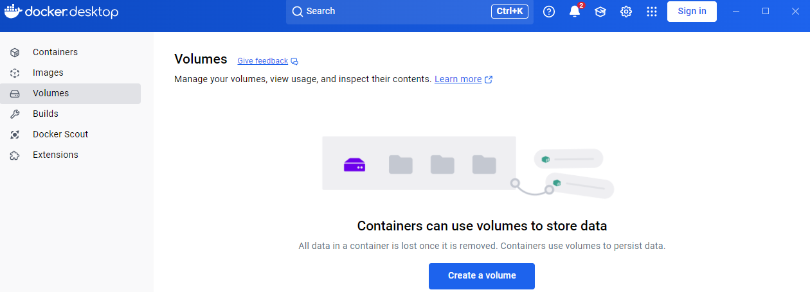
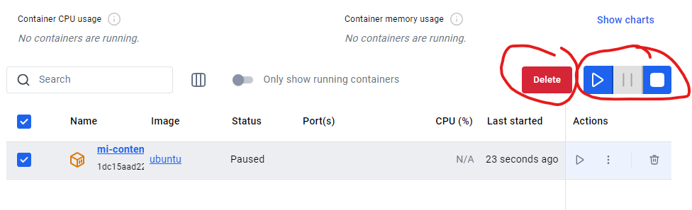
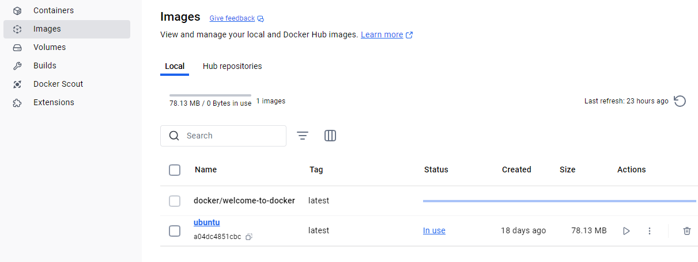
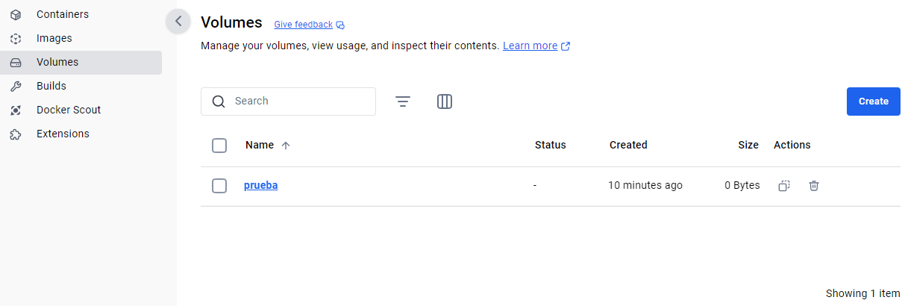

# Manual de Docker Desktop

> Tarea evaluable Docker - Ejercicio 1  - Samuel Muñiz González , Oscar Mateos Ramos

[TOC]

## Introduccion 

Docker Desktop es una aplicación que permite construir, ejecutar y administrar contenedores Docker de manera sencilla en Windows y macOS. Este manual proporciona una guía básica sobre su instalación y uso

## 1. Instalación de Docker Desktop

### 1.1 Requisitos previos

- Windows 10/11 (con WSL 2 habilitado) o macOS
- 4GB de RAM mínimo
- Virtualización habilitada en la BIOS

### 1.2 Descarga e Instalación

1. Ve al sitio oficial de Docker: https://www.docker.com/products/docker-desktop

   

2. Descarga la versión correspondiente a tu sistema operativo.

3. Ejecuta el instalador y sigue los pasos.

4. Reinicia tu computadora si es necesario.

5. Abre Docker Desktop y verifica que esté en funcionamiento.

## 2. Configuración Inicial

1. Inicia Docker Desktop.
2. Asegúrate de que Docker esté ejecutándose revisando el icono en la barra de tareas.
3. En Windows, verifica que WSL 2 esté habilitado (Configuración > Recursos > WSL Integration).

## 3. Comandos Básicos de Docker y uso de terminal

Docker Desktop cuenta con una terminal para poder usarla y ejecutar comandos Docker. Estos son comandos básicos de Docker

| Comando                       | Descripción                                     |
| ----------------------------- | ----------------------------------------------- |
| `docker --version`            | Verifica la versión de Docker instalada         |
| `docker run hello-world`      | Prueba si Docker está funcionando correctamente |
| `docker images`               | Lista las imágenes disponibles en tu equipo     |
| `docker ps`                   | Muestra los contenedores en ejecución           |
| `docker ps -a`                | Lista todos los contenedores creados            |
| `docker stop <ID_CONTENEDOR>` | Detiene un contenedor en ejecución              |
| `docker rm <ID_CONTENEDOR>`   | Elimina un contenedor detenido                  |
| `docker rmi <ID_IMAGEN>`      | Elimina una imagen de Docker                    |

Para poder usar la Terminad de Docker Desktop simplemente hay que hacer un click abajo a la derecha donde pone Terminal

## 4. Uso de Docker Desktop

### 4.1 Interfaz Principal

Al abrir Docker Desktop, encontrarás varias pestañas clave:

- **Containers**: Muestra los contenedores en ejecución.

- **Images**: Lista las imágenes disponibles en tu sistema.

- **Volumes**: Administra los volúmenes de almacenamiento.

- **Extensions**: Permite agregar funcionalidades adicionales a Docker Desktop.

  

### 4.2 Creación y Gestión de Contenedores desde Cero

1. **Descargar una Imagen Base**:
   - Ve a la pestaña **Images**.
   - Haz clic en **Search image to run**.
   - Busca una imagen en **Docker Hub** (por ejemplo, `nginx` o `ubuntu`).
   - Descárgala haciendo clic en **Pull**.
   
2. **Crear un Contenedor**:
   - Ve a la pestaña **Containers** y haz clic en **Create Container**.
   - Selecciona la imagen que descargaste.
   - Configura el contenedor:
     - **Asigna un nombre** para identificarlo fácilmente.
     - **Define los puertos** para acceder a los servicios del contenedor.
     - **Configura volúmenes** si necesitas persistencia de datos.
     - **Selecciona redes personalizadas** si el contenedor debe comunicarse con otros servicios.
   - Haz clic en **Run** para iniciarlo.
   
3. **Administrar Contenedores**:
   - Una vez iniciado, puedes ver su estado en la pestaña **Containers**.
   
   - Usa los botones disponibles para **detener, eliminar o reiniciar** el contenedor según sea necesario.
   
   - Puedes abrir una terminal dentro del contenedor para ejecutar comandos directamente.
   
     

### 4.3 Gestión de Imágenes

1. Ve a la pestaña **Images**.

2. Ahí te saldrá una lista de imágenes que tienes

3. Puedes eliminar imágenes no utilizadas para liberar espacio.

   

### 4.4 Uso de Volúmenes

1. Dirígete a la pestaña **Volumes**.

2. Crea un volumen y asígnalo a un contenedor.

3. Esto permite que los datos se mantengan incluso si el contenedor se elimina.

   

## 5. Solución de Problemas

1. **Verificar el estado de Docker:**

- **Docker Desktop** te muestra un **banner de estado** en la parte superior (si hay un problema). Si Docker está teniendo problemas, allí podrías ver un enlace para **"diagnosticar"** o **"ver detalles"** sobre el error.

2. **Reiniciar Docker Desktop:**

- Si Docker está funcionando incorrectamente, a veces solo es necesario **reiniciar Docker**. Puedes hacer esto desde el ícono de Docker en la bandeja del sistema (Windows) o barra de menús (macOS), haciendo clic derecho y seleccionando **Restart Docker Desktop**.

3. **Restablecer Docker a su configuración predeterminada:**

- En Settings > Reset encontrarás opciones como:
  - **"Reset to factory defaults"**: Restablece Docker a su configuración predeterminada.
  - **"Clean / Purge data"**: Elimina imágenes, contenedores y volúmenes no utilizados.

## 6. Conclusión

Docker Desktop facilita el uso de contenedores Docker sin necesidad de comandos complejos. Con este manual, ahora puedes gestionar imágenes, contenedores y volúmenes de manera eficiente desde su interfaz gráfica.