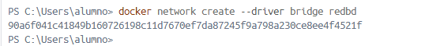

# Ejercicio 3 - Contenedores en Red Adminer y MariaBD

1. Crea una red bridge redbd
    
    ```bash
    docker network create --driver bridge redbd
    ```
    
    
    
2. Crea un contenedor con una imagen de
mariaDB que estará en la red
redbd. Este contenedor se ejecutará en segundo plano, y será accesible a través del puerto 3306. (Es necesario definir la contraseña del usuario root y un volumen de datos persistente)
    
    
    ```bash
    docker run -d --name mariadb-container --network redbd -e MYSQL_ROOT_PASSWORD=123 -v mariabd_data:/var/lib/mysql -p 3306:3306 mariadb:latest
    
    ```
    
    
    
    Comprobamos que el contenedor se creo correctamente haciendo un docker ps
    
    
    
3. Crear un contenedor con Adminer o con phpMyAdminque se pueda conectar alcontenedor de la BD
    
    
    ```bash
    docker run -d --name adminer-container --network redbd -p 8080:8080 adminer:latest
    ```
    
    
    
    Comprobamos que el contenedor se creo correctamente haciendo un  docker ps
    
    
    
4. Desde la interfaz gráfica, crear una base de datos y una tabla en el servidor de base de
datos
    
    
    
    
    


Eliminamos los contedores utilizados usando docker rm  y el nombre del contendor si el contenedor que  queremos borrar esta en ejecucion deberemos hacer un docker stop y el nombre del contendor

```bash
docker stop adminer-container
```


```bash
docker rm adminer-container
```


```bash
docker stop mariadb-container
```


```bash
docker rm mariadb-container
```

