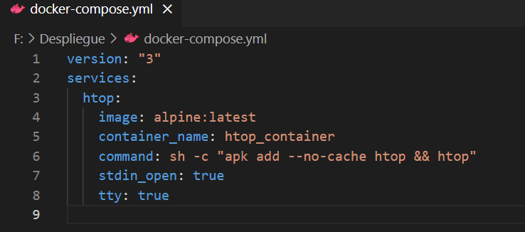
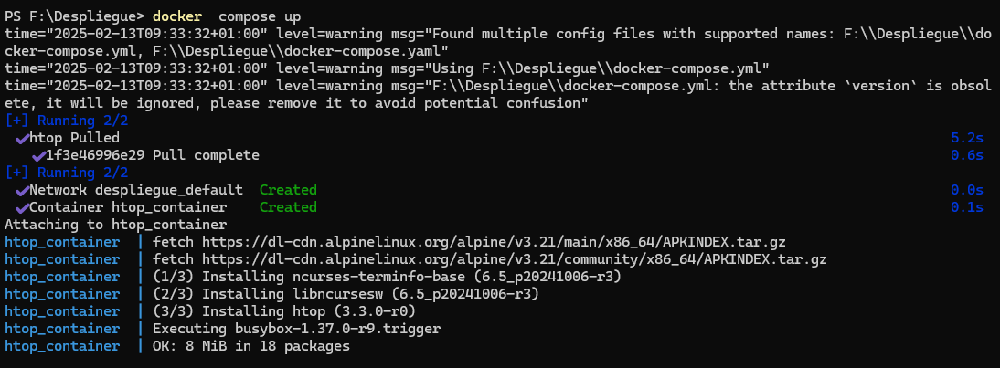

# Ejercicio 4 - Docker Compose

Desplegar la aplicación htop utilizando docker-compose. Entregar las siguientes capturas de pantalla  y los comandos empleados para resolver el ejercicio

1. Creamos el archivo docker-compose.yml

Htop es una herramienta que nos permite monitorear el rendimiento del sistrema en tiempo real. A diferencia de otras herramientas similares, **htop** ofrece una interfaz más amigable y con más opciones de interacción, lo que la convierte en una opción popular para los administradores de sistemas y usuarios avanzados.

además nos permite terminar o pausar procesos

