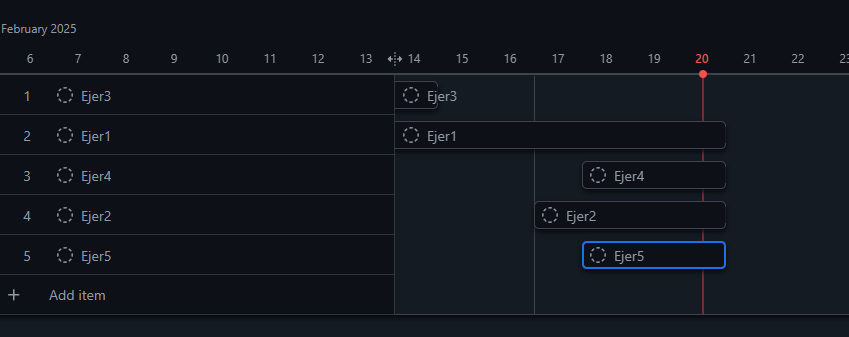

# Informacion sobre trabajo

Creación de las ramas Samuel Muñiz González

Ejer 1 para el 20/02/25 Samuel Muñiz González

Ejer 2 para el 20/02/25 Samuel Muñiz González

Ejer 3 para el 14/02/25 Oscar Mateos Ramos

Ejer 4 para el 20/02/25 Oscar Mateos Ramos

Ejer 5 para el 20/02/25  Samuel Muñiz González

Archivo de reparto de tareas y asignación de fechas: Ambos

Roadmap del Repositorio

Conclusiones

A lo largo de este proyecto, hemos enfrentado algunos desafíos, especialmente en la colaboración y en la asignación de tareas. Específicamente, un integrante no pudo contribuir de manera efectiva debido a su falta de conocimiento sobre la instalación y configuración de Docker Desktop. Esto llevó a una desigualdad en la carga de trabajo, ya que otro miembro del grupo tuvo que asumir tareas adicionales para garantizar que el proyecto avanzara.

A pesar de estos desafíos, logramos completar el proyecto y aprendimos valiosas lecciones sobre el trabajo en equipo y la importancia de la colaboración.