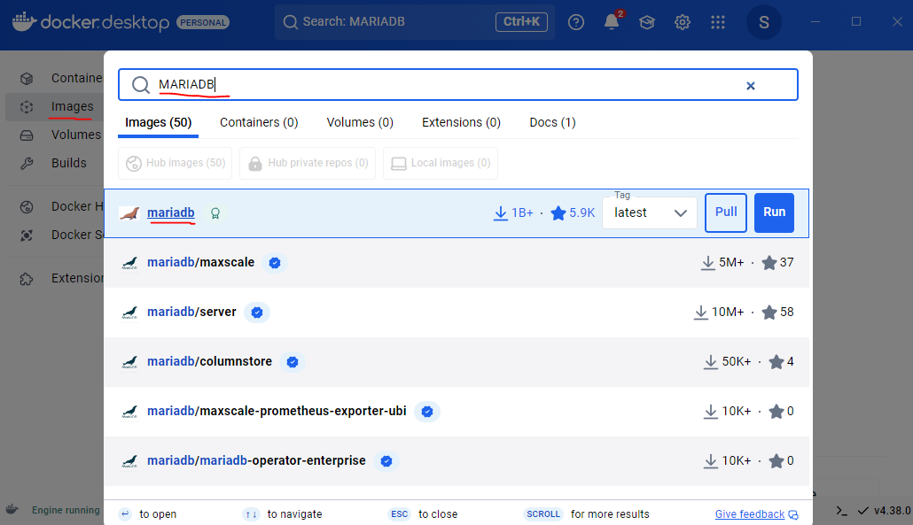
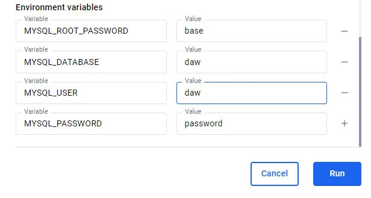

# Ejercicio 2  - Servidor de base de datos

# Ejercicio 2  - Servidor de base de datos

1. Abre Docker Desktop. Busca mariadb en la sección de imágenes. Selecciona la imagen
oficial. Descárgala si no la tienes.

1. Despliega un contenedor utilizando esa imagen. Características:
- **Nombre del contenedor:** bbdd.
- **Puerto:** 3306 - debe poder conectarse externamente.
- **Utiliza un volumen llamado** datos-mariadb.
- **Usa las variables de entorno necesarias para que:**
    - **El usuario root tenga la contraseña:** base.
    - **La base de datos por defecto sea:** daw.
    - **Se cree un usuario:** daw, con la contraseña password.
    
    
    

1. Arranca el contenedor

4.Accede a la base de datos usando una herramienta gráfica, como, por ejemplo

dbeaver. Conéctate con el usuario daw. Crea una base de datos y alguna tabla.

1. Borra el contenedor

 6. Ver en Docker Desktop que el volumen que contiene los datos no se ha borrado

1. Crear otro contenedor con un servidor de base de datos que use el mismo volumen.
Llamar al contenedor bbdd-2. Comprobar que la base de datos y la tabla creada
anteriormente siguen ahí.

Despues de volverme a conectar a la base de dartos, puedo ver que sigue ahi la tabla 

1. Intenta borrar la imagen de mariadb ¿Qué sucede?

Docker no  permite eliminar la imagen porque aún hay contenedores asociados con ella. Debería detener y eliminar todos los contenedores que utilizan esa imagen antes de poder eliminar la imagen.

En este orden, podemos ver que hemos borrado la imagen con éxito

