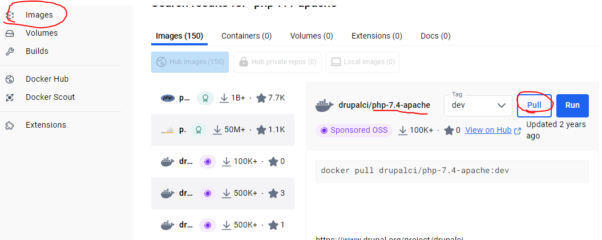

# Ejercicio 5 - imagen con Dockerfile - Aplicación web

Arranca un contenedor que ejecute una instancia de la imagen php:7.4-apache, que se
llame web y que sea accesible desde un navegador en el puerto 8000.




Coloca en el directorio raíz del servicio web (/var/www/html) un "sitio web" donde figure
el nombre de los componentes del grupo - el sitio deberá tener al menos un archivo
index.html y un archivo .css. Coloca en ese mismo directorio raíz el siguiente script
php

```html
<!DOCTYPE html>
<html lang="es">
<head>
    <meta charset="UTF-8">
    <meta name="viewport" content="width=device-width, initial-scale=1.0">
    <title>Grupo de Trabajo</title>
    <link rel="stylesheet" href="style.css">
</head>
<body>
    <header>
        <h1>Bienvenidos a Nuestro Sitio</h1>
    </header>
    <main>
        <section>
            <h2>Integrantes del Grupo</h2>
            <ul>
                <li>Oscar Mateos</li>
                <li>Samuel Muñiz</li>
            </ul>
        </section>
    </main>
    <footer>
        <p>&copy; 2025 Grupo de Trabajo</p>
    </footer>
</body>
</html>
```

```css
body {
    font-family: Arial, sans-serif;
    background-color: #f4f4f4;
    text-align: center;
}

header {
    background-color: #333;
    color: white;
    padding: 20px;
}

main {
    margin: 20px;
}

ul {
    list-style: none;
    padding: 0;
}

li {
    font-size: 1.2em;
    margin: 10px 0;
}

footer {
    background-color: #333;
    color: white;
    padding: 10px;
    position: absolute;
    width: 100%;
    bottom: 0;
}

```

```php
<?php
 setlocale(LC_TIME, "es_ES.UTF-8");
 $mes_actual = strftime("%B");
 $fecha_actual = date("d/m/Y");
 $hora_actual = date("H:i:s");
 ?>
 echo "<h1>Información</h1>";
 echo "<p>Hoy es $fecha_actual</p>";
 echo "<p>El mes es: <strong>$mes_actual</strong></p>";
 echo "<p>Hora: $hora_actual</p>"
```


Ver la salida del script y de la página index en el navegador

Captura de pantalla y documento donde se ve el acceso al navegador con el sitio servido


Bloque de código con el Dockerfile:

```php
# Dockerfile
FROM php:7.4-apache

# Establecer el directorio de trabajo
WORKDIR /var/www/html

# Cambiar los permisos del directorio
RUN chown -R www-data:www-data /var/www/html

# Habilitar el módulo de reescritura de Apache (opcional, pero recomendado)
RUN a2enmod rewrite

```

Borrado del contenedor


Captura de pantalla y documento donde se vea la imagen subida a tu cuenta de Docker
Hub.

Captura de pantalla y documento donde se vea la bajada de la imagen

 - por parte de otra persona del grupo 

 - y la creación de un contenedor

Este apartado no se pudo realizar ya que el integrante Oscar no fue capaz de instalar el Docker Desktop